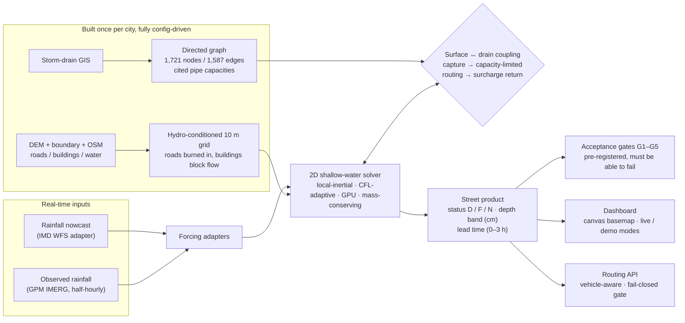

# JALADHAR — Urban Flood Nowcasting

**Predict which streets will flood 0–3 hours before they do.**

JALADHAR couples a rainfall nowcast with a GPU 2D shallow-water solver on a 10 m terrain grid and
a directed graph of the city's storm drains. Every timestep, water that the surface sends into a
drain is routed through the network under a capacity limit — and water that exceeds capacity comes
back onto the street as surcharge. The output is per-street flood status, a depth band in cm, and
lead time — served through a live dashboard and a vehicle-aware routing API.

Built for **Smart India Hackathon 2026 — problem statement 26085** (MoES / NCMRWF, Software,
Disaster Management):

> *"Design a high-resolution, real-time Urban Flood Nowcasting System (0–3 hour lead time) capable
> of predicting street-level inundation before it happens, by coupling rainfall nowcasts with a 2D
> high-resolution terrain model and a graph-based hydraulic model of the city's stormwater drain
> network, including surcharge and backflow onto streets."*

Development city: **Bengaluru**, replaying the real 4–6 September 2022 storm from archived
satellite rainfall. Every city-specific value lives in config (`configs/domain_<city>.yaml`) —
the physics code contains no hardcoded city, so the pipeline ports to the next metro by swapping
configuration, not code.

---

## The pipeline



Two deliberate design choices:

- **Physics, not a rendering trick.** The solver is a local-inertial shallow-water scheme with an
  adaptive-CFL time step and a closed water ledger. If the model has nothing to say, the dashboard
  shows an empty state — no placeholder simulation.
- **Nothing is hardcoded.** Every number the dashboard or API displays is read from a
  manifest-backed product file. Producer–consumer interfaces are frozen JSON contracts
  (`configs/contracts/`), asserted at load time on both sides.

---

## What is measured

All values below are read from run manifests (the products live in the data archive; `runs/` and
`data/` are not shipped in git — each figure names its file).

| Quantity | Measured value | Evidence |
|---|---|---|
| Terrain grid | 12,728,415 valid cells at 10 m | `runs/terrain_*/manifest.json` |
| Mass conservation (48 h storm replay) | water-balance residual 1.79e-05 of inflow | `runs/solver/` |
| Drain graph | 1,721 nodes / 1,587 edges — 1,301 observed, 286 synthesised connectors, every edge tagged | `runs/drain_graph_build/manifest.json` |
| Hydraulic capacity | 1,208 edges rated (CPHEEO 2019 design basis), max 276.55 m³/s; 70 exceed capacity under the design storm | same, `capacity_metrics` |
| Coupling water closure (tile smoke) | residual 2.7e-07 of total water | `runs/wf2_coupled_smoke/` |
| 3 h forecast product | 25.94 mm window rainfall → 17,520 flooded segments, warm-started at issue time | `runs/wf3_uncoupled_3h_forecast_warm_product/manifest.json` |
| 8-frame series (what the dashboard plays) | peak 17,953 flooded segments at t + 90 min | `runs/wf8_3h_forecast_frames/manifest.json` |
| Latency, 1/16-domain tile (795,664 cells) | 23.07 s, full 3 h horizon | `runs/wf2_tile_throughput/manifest.json` |
| Latency, full domain | 58.0 min (operational design: tile to the storm cell, never the whole city) | same |

## Validation — the honest part

Five acceptance gates (**G1–G5**) were written *before* any number existed, each with a threshold
it can fail. They are scored by `scripts/score_g1.py` against municipal complaint points, curated
depth reports with quoted sources, and a 10,000-draw spatial null model.

| Gate | Criterion | Bengaluru status |
|---|---|---|
| G1 | Street classification: ≥ 60% hit rate on 399 municipal flood-prone points, null-model lift ≥ 3.0 | **FAIL — 26.1%, lift 1.30** |
| G2 | Surcharge mechanism traceable to a named drain node | anti-vacuity pass at tile scope; not scoreable here (see below) |
| G3 | Depth band accuracy on curated reports | blocked — ground truth too scarce to score (16 strict rows) |
| G4 | Rain in → published depth field in ≤ 10 min | **PASS at tile scope** (23–215 s), fails full-domain |
| G5 | Flooded-extent instrument validated on urban flooding | open — no instrument yet qualifies |

The G1 deficit is measured, not guessed, and traced to Bengaluru's public data: the DEM encodes
lake *water surfaces* rather than lake *basins* (Varthur interior std 0.16 m — the fill-and-spill
mechanism is structurally absent from the input), the public drain map carries geometry only
(no width, depth or invert) in 370 disconnected components, and Bengaluru has no Doppler radar, so
the IMD nowcast is spatially uniform. No calibration lever closes this — the input data lacks
something the physics needs. That finding, with the evidence, is why the pipeline is
config-driven: the next city (a radar-covered metro with a drain GIS that reaches outfalls) gets
the same gates as its acceptance test.

## Repository map

```
jaladhar/
├── deploy.sh                     # one command: ./deploy.sh --check verifies a restore, ./deploy.sh serves the demo
├── configs/
│   ├── domain_bengaluru.yaml     # every city-specific value: CRS, DEM tiles, boundary, roads, conditioning
│   ├── solver.yaml               # numerics: time step, roughness, boundary, CFL bounds
│   ├── forcing.yaml              # rainfall input: historical IMERG / forecast / live nowcast (mutually exclusive)
│   ├── drainage.yaml             # capacity rule + the citations behind it
│   ├── coupling.yaml             # capture / routing / surcharge-return parameters
│   ├── routing.yaml              # road graph, vehicle classes, snap policy
│   ├── compute.yaml              # device pool + budget ceiling (expensive stages refuse to exceed it)
│   └── contracts/                # 4 frozen JSON interfaces: drain graph, coupling, depth product, nowcast input
├── src/jaladhar/
│   ├── terrain/                  # DEM/boundary fetch, OSM layers, hydro-conditioning → the 10 m grid
│   ├── solver/                   # 2D local-inertial shallow water: ACC stencil, CFL control, mass ledger, checkpoints
│   ├── forcing/                  # IMERG (anchored), Open-Meteo, KSNDMC gauges, IMD WFS nowcast adapters
│   ├── drainage/                 # KML/shapefile ingest → endpoint snap → D8 stitch → graph + cited capacities
│   ├── coupling/                 # inlet capture, capacity-limited routing, surcharge return, water-closure ledger
│   ├── validation/               # event replay driver, segment-status frames, G1/G3 scorers
│   ├── web/                      # dashboard: stdlib HTTP server + dependency-free Canvas UI (no tile service)
│   ├── routing/                  # road graph from OSM, vehicle wading policy, fail-closed routing API
│   └── provenance.py             # run manifests written at start and updated in place; dirty-tree refusal
├── scripts/                      # typer CLIs for every stage; demo launcher + rehearsal under scripts/demo/
├── tests/                        # 69 files: unit tests + realized-state checks that verify bytes on disk
├── bench/                        # solver micro-benchmarks and the analytical correctness ladder
├── data/seed/                    # 5.7 MB curated seed data with SHA256SUMS — the only data shipped in git
└── docs/                         # provenance witness for the promoted elevation surface
```

## Quick start

```bash
# from a full data restore (demo products are not in git)
./deploy.sh --check      # verifies every artifact the demo loads; starts nothing
./deploy.sh              # dashboard http://127.0.0.1:8501 · routing API http://127.0.0.1:8502/health

# test suite (CPU-only)
CUDA_VISIBLE_DEVICES="" .venv/bin/python -m pytest -q -p no:cacheprovider
```

Fresh clone:

```bash
uv venv --python 3.11 && uv pip install -e .   # pick torch backend first (cpu or cu124)
python scripts/bootstrap_data.py               # unpack + verify seed data
python -m jaladhar.terrain.fetch               # boundary + DEM + OSM layers (re-fetchable sources)
python -m jaladhar.terrain.build               # the hydro-conditioned grid
```

The dashboard and routing API run on the Python standard library — no web framework. The
dashboard frontend is hand-written Canvas 2D with zero runtime dependencies.

## What's next

1. **Live nowcast ingestion** — the IMD WFS adapter is written and contract-tested; wire the
   endpoint config and let a real issued nowcast force a run.
2. **City switch** — port to a metro with Doppler radar coverage and an outfall-reaching drain
   GIS; the gates G1–G5 are the acceptance criteria. Tide- or river-gated outfalls need a
   stage-hydrograph boundary condition (new solver work).
3. **Operations** — storm-tile auto-selection from the rainfall field and a 15–30 min refresh
   scheduler, so full-domain latency never enters the operational path.
4. **Routing depth** — intersection splitting and series-aware blocking on the road graph.

## Engineering discipline

- **Run manifests for everything**: inputs, parameters, git state, wall clock — written when a run
  *starts* and updated on completion, so a failed run still leaves provenance.
- **Producer–consumer seam assertions**: every artifact's guaranteed properties are asserted at
  load, not trusted from a README.
- **Pre-registered gates**: acceptance thresholds were signed before results existed, and each can
  fail.
- **No synthetic shortcuts**: where a data source is missing or invalid, the system says so and
  stops — the empty state is a feature, not a gap.

## References

Bates, Horritt & Fewtrell (2010) *J. Hydrology* 387:33–45 — local-inertial formulation ·
Fan et al. (2017) *Adv. Meteorology* 2819308 — coupled 1D–2D urban flooding · CPHEEO (2019)
*Manual on Storm Water Drainage Systems*, MoHUA — capacity basis · Shand et al. (2011) ARR
Project 10 — vehicle stability criteria · Rossman (2015) *SWMM 5.1 User's Manual*, EPA.
